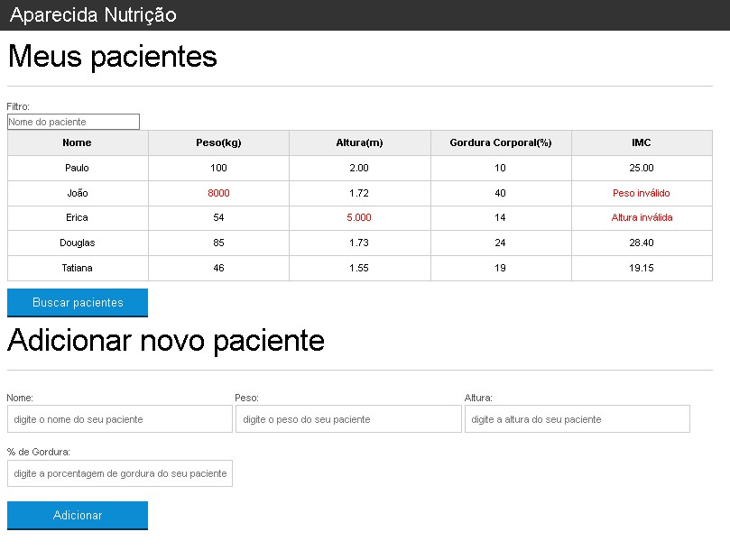

  

  

Este projeto tem como sua finalidade servir como base de estudo para o javascript, Estudando sua sintaxe e como a linguagem funciona e quais são suas nuancias.

## Oque eu aprendi
<ul>
    <li>Variáveis e Operadores</li>
    <li>Arrays, Loop e Estilos</li>
    <li>Eventos, Formularios e Criação de elementos</li>
    <li>Boas praticas</li>
    <li>Validação de Formularios</li>
    <li>Remoção, Delegação e Animação</li>
    <li>Filtrando uma Tabela</li>
    <li>Buscando pacientes com Ajax</li>
    
</ul>

## Tecnologias utilizadas durante o curso
* Javascript

## Tecnologias utilizadas no projeto
* HTML
* CSS